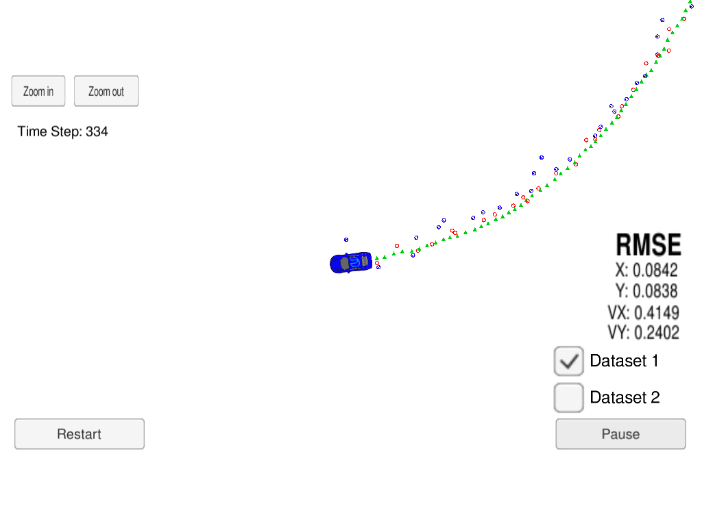
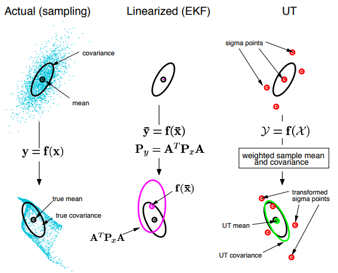

## README

### Technical Report for Lidar & Radar Sensor Fusion using UKF estimation and CTRV motion model

---



The goals of this project are the following:

* Implement the **discretized Constant Turing Rate and Velocity Magnitude (CTRV)** motion model.
* Implement the **unscented Kalman filter (UKF)** based lidar & radar sensor fusion algorithm.
* Achieve the desired precision on the given test dataset

---

### Algorithm Workflow

---

#### General Processing Flow

The general processing flow of algorithm is as follows:


#### Main Difference between UKF and EKF



#### First Measurement Processing

For the first measurement:

1. The state variable *time_us_* is set.
2. State vector *x_* and state covariance matrix *P_xx_* are initialized.

```cpp
// first timestamp:
  time_us_ = meas_package.timestamp_;

  // first measurement:
  if (meas_package.sensor_type_ == MeasurementPackage::RADAR) {
    //
    // Convert radar from polar to cartesian coordinates and initialize state.
    //
    // parse radar measurements:
    double ro, theta, ro_dot;

    ro = meas_package.raw_measurements_(0);
    theta = meas_package.raw_measurements_(1);
    ro_dot = meas_package.raw_measurements_(2);

    // position:
    x_(0) =  ro * cos(theta);
    x_(1) =  ro * sin(theta);

    // set initial state covariance matrix according to radar measurement noise:
    P_xx_(0, 0) = R_radar_(0, 0);
    P_xx_(1, 1) = R_radar_(0, 0);
    P_xx_(2, 2) = pow(std_v_, 2);
    P_xx_(3, 3) = R_radar_(1, 1);
    P_xx_(4, 4) = pow(std_yawd_, 2);
  }
  else if (meas_package.sensor_type_ == MeasurementPackage::LASER) {
    //
    // Initialize state from lidar measurements:
    //
    double px, py;

    px = meas_package.raw_measurements_(0);
    py = meas_package.raw_measurements_(1);

    // position:
    x_(0) = px;
    x_(1) = py;

    // set initial state covariance matrix according to lidar measurement noise:
    P_xx_(0, 0) = R_laser_(0, 0);
    P_xx_(1, 1) = R_laser_(1, 1);
    P_xx_(2, 2) = pow(std_v_, 2);
    P_xx_(3, 3) = pow(std_yaw_, 2);
    P_xx_(4, 4) = pow(std_yawd_, 2);
  }
```

#### Predict

First the time elapsed between previous and current timestamps is evaluated.

After the augmented state mean and covariance are set,
sigma points are generated and current state and covariance are predicted.

```cpp
  /*****************************************************************************
  *  Time elapsed
  ****************************************************************************/
  long long current_time_us = meas_package.timestamp_;
  long long delta_t = current_time_us - time_us_;
  time_us_ = current_time_us;

  /*****************************************************************************
  *  Sampling
  ****************************************************************************/
  GenerateSigmaPoints();

  /*****************************************************************************
  *  Prediction
  ****************************************************************************/
  Predict(delta_t / 1e6);
```

The discretized CTRV motion model is implemented as follows:

```cpp
  /**
   * Make state prediction using discretized Constant Turing Rate and Velocity(CTRV) model
   * @param {const VectorXd &} x current state
   * @param {const double} delta_t time elapsed between current and last state
   */
  VectorXd UKF::DoPredict(const VectorXd &x, const double delta_t){
      // division-by-zero check:
      const double epsilon = 1e-7;

      // parse augmented state:
      const double p_x = x(0);
      const double p_y = x(1);
      const double v = x(2);
      const double psi = x(3);
      const double psi_dot = x(4);
      const double v_dot = x(5);
      const double psi_ddot = x(6);

      // allocate:
      VectorXd x_pred(5);
      // common terms:
      x_pred << p_x + 0.5 * cos(psi) * v_dot * pow(delta_t, 2),
                p_y + 0.5 * sin(psi) * v_dot * pow(delta_t, 2),
                v + v_dot * delta_t,
                psi + psi_dot * delta_t + 0.50 * psi_ddot * pow(delta_t, 2),
                psi_dot + psi_ddot * delta_t;

      if (abs(psi_dot) < epsilon) {
          // use straight line model:
          x_pred(0) += v * cos(psi) * delta_t;
          x_pred(1) += v * sin(psi) * delta_t;
      } else {
          // use curve line model:
          x_pred(0) += v / psi_dot * (
              sin(psi + psi_dot * delta_t) - sin(psi)
          );
          x_pred(1) += v / psi_dot * (
              -cos(psi + psi_dot * delta_t) + cos(psi)
          );
      }

      return x_pred;
  }
```

And UKF prediction step is as below:

```cpp
  void UKF::Predict(const double delta_t) {
    // get predicted states using sigma points:
    for (int i = 0; i < 2 * n_aug_ + 1; ++i) {
      Xsig_pred_.col(i) = DoPredict(Xsig_.col(i), delta_t);
    }

    // predicted state mean:
    x_ = Xsig_pred_ * weights_;

    // deviations from mean:
    Xsig_pred_dev_ = Xsig_pred_.colwise() - x_;

    // predicted state covariance matrix:
    P_xx_ = Xsig_pred_dev_ * (Xsig_pred_dev_.transpose().array().colwise() * weights_.array()).matrix();
  }
```

#### Update

Update procedure depends on measurement type.

First the predicted measurements are generated using predicted states and corresponding measurement model.

After that, predicted state is corrected based on the error between true and predicted observation.

```cpp
  /*****************************************************************************
  *  Update
  ****************************************************************************/
  // parse measurements
  const VectorXd &z = meas_package.raw_measurements_;

  if (meas_package.sensor_type_ == MeasurementPackage::RADAR) {
    // Radar updates
    UpdateRadar(z);
  } else {
    // Laser updates
    UpdateLidar(z);
  }
```

Take radar measurement procedure as example, the UKF correction step is as below:

```cpp
  /**
  * Updates the state and the state covariance matrix using a radar measurement.
  * @param {const VectorXd &} z
  */
  void UKF::UpdateRadar(const VectorXd &z) {
    // Get predicted observations:
    for (int i = 0; i < 2 * n_aug_ + 1; ++i) {
      Zsig_radar_pred_.col(i) = DoUpdateRadar(Xsig_pred_.col(i));
    }

    // predicted observation mean:
    z_radar_ = Zsig_radar_pred_ * weights_;

    // deviation from mean:
    Zsig_radar_pred_dev_ = Zsig_radar_pred_.colwise() - z_radar_;

    // predicted observation covariance matrix:
    P_zz_radar_ = Zsig_radar_pred_dev_ * (Zsig_radar_pred_dev_.transpose().array().colwise() * weights_.array()).matrix() + R_radar_;

    // predicted state-observation correlation matrix:
    P_xz_radar_ = Xsig_pred_dev_ * (Zsig_radar_pred_dev_.transpose().array().colwise() * weights_.array()).matrix();

    // kalman gain:
    K_radar_ = P_xz_radar_ * P_zz_radar_.inverse();

    // update state:
    x_ = x_ + K_radar_ * (z - z_radar_);
    // update state covariance matrix:
    P_xx_ = P_xx_ - K_radar_ * P_zz_radar_ * K_radar_.transpose();
  }
```

---

### Tracking Accuracy

---

Algorithm performance on dataset 1 & 2 are as follows:

|  Dataset |               Accuracy             |
|:--------:|:----------------------------------:|
| Dataset1 |  [0.0797, 0.0858, 0.3556, 0.2445]  |
| Dataset2 |  [0.0791, 0.0834, 0.3798, 0.2462]  |

Which meets the required accuracy
